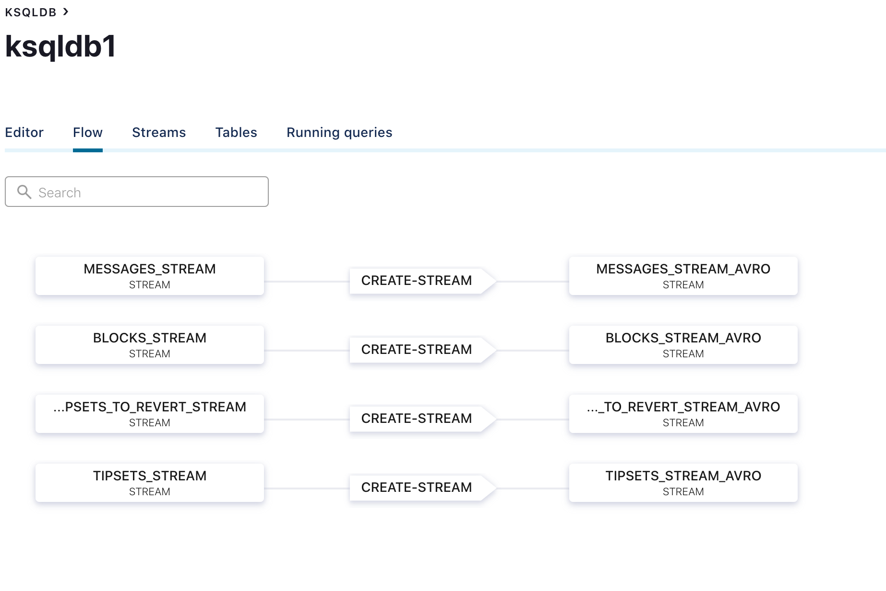
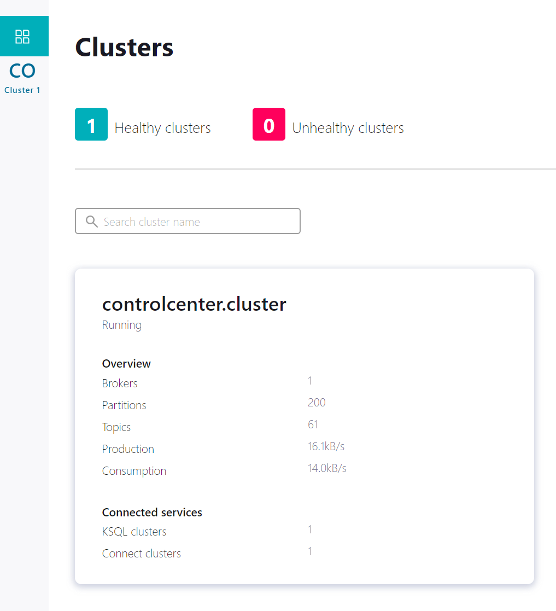
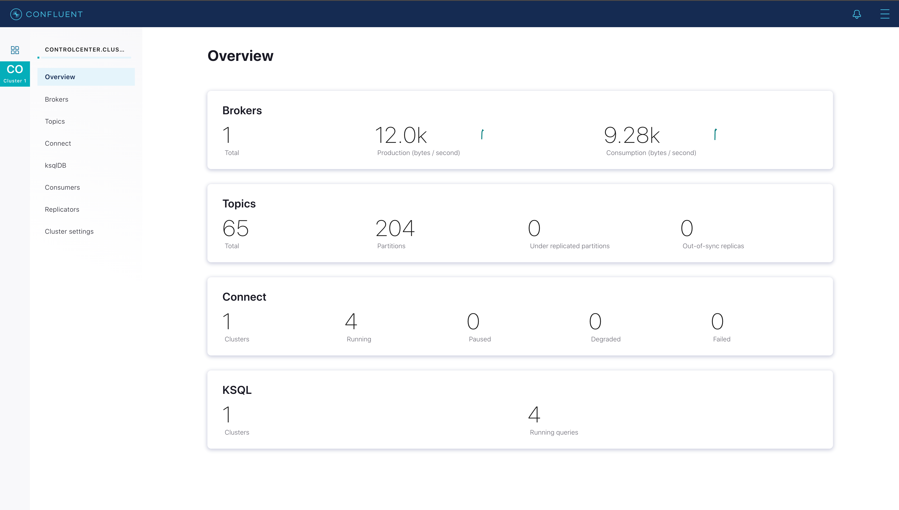
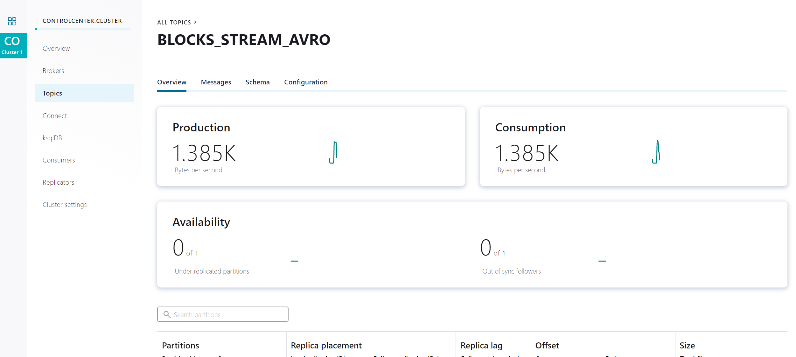
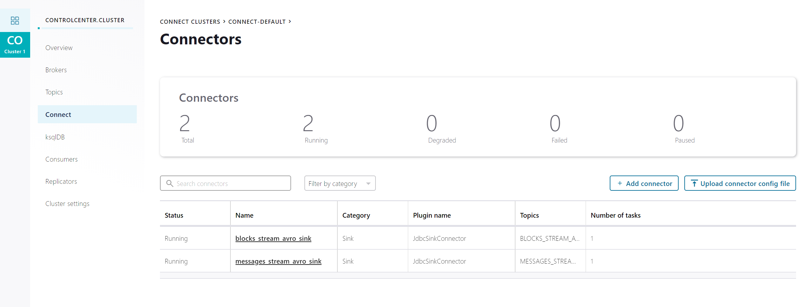
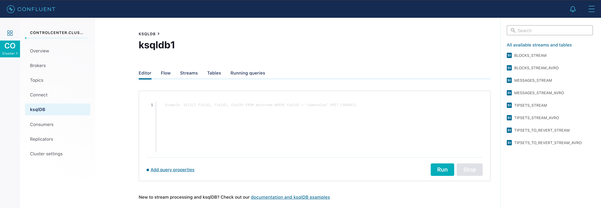
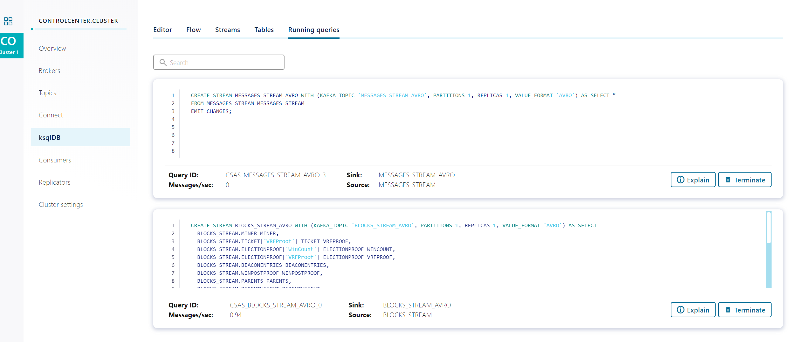

## Requirements
* Docker v1.11+
* Docker Compose
* Docker memory is allocated minimally at 8 GB

## Before start 
```shell script
./start-docker.sh
```

## What does the script do?
The script will start all necessary infrastructure: KSQLDB, Kafka, ZooKeeper, PostgreSQL containers, create all demo streams and connectors for DB (It'll take about 5 minutes).

## How to configure and start streamer
You can start mbelt-filecoin-streamer via docker-compose or via go build/run/install.

To start via docker compose, you need to modify env variables in docker-compose.yml and execution flags in Dockerfile (if needed) and then just run
```shell script
docker-compose up filecoin-streamer-worker
```

Or set necessary environment variables (see table below), go build or go install main.go in root of this repository and run it with or without execution flags (flags table below as well)   

Examples:
```shell script
go install github.com/p2p-org/mbelt-filecoin-streamer
mbelt-filecoin-streamer --sync-force --sub-head-updates=false
```
or

```shell script
go build -o mbelt-filecoin-streamer github.com/p2p-org/mbelt-filecoin-streamer
mbelt-filecoin-streamer --sync-from=1000
```

#### Environment variables

| Variable | Description | Example |
| ---- | ---- | ---- |
| `MBELT_FILECOIN_STREAMER_API_URL` | URL to filecoin node http API | `http://127.0.0.1:1234/rpc/v0` |
| `MBELT_FILECOIN_STREAMER_API_WS_URL` | URL to filecoin node websocket API | `ws://127.0.0.1:1234/rpc/v0` |
| `MBELT_FILECOIN_STREAMER_API_TOKEN` | Token for filecoin node API | |
| `MBELT_FILECOIN_STREAMER_KAFKA` | URL to Kafka | `http://127.0.0.1:9092` |
| `MBELT_FILECOIN_STREAMER_PG_URL` | URL to PostgreSQL DB with credentials needed to connect | `postgres://127.0.0.1:5432/raw?user=sink&password=123S&sslmode=disable` |

#### Execution flags

| Flag | Description | Default |
| ---- | ---- | ---- |
| `-s`, `--sync` | Turn on sync starting from last block in DB | `true` |
| `-f`, `--sync-force` | Turn on sync starting from genesis block | `false` |
| `-u`, `--sub-head-updates` | Turn on subscription on head updates | `true` |
| `-F`, `--sync-from` | Height to start sync from. Dont provide or provide negative number to sync from max height in DB | -1 |
| `-o`, `--sync-from-db-offset` | Specify offset from max height in DB to start sync from (maxHeightInDb - offset) | 100 |

## What is happening inside ksqlDB?
Data flow:


Data that is being requested by mbelt-filecoin-streamer from filecoin node is being pushed to Kafka topics **tipsets_stream**, **blocks_stream**, **messages_stream**, **tipsets_to_revert_stream**.
Then this data is being pushed to corresponding ksqlDB streams (**TIPSET_STREAM**, **BLOCKS_STREAM**, **MESSAGES_STREAM**, **TIPSETS_TO_REVERT_STREAM**)  and further to corresponding streams with **_AVRO** suffix where they are being converted to AVRO format.
Then data is being sinked to PostgreSQL tables **filecoin._tipsets**, **filecoin._blocks**, **filecoin._messages**, **filecoin._tipsets_to_revert** (**_** prefix means that tables are temporary), then triggers on those tables convert data into more suitable for storing format and push them to corresponding tables with no **_** prefix in their name. Triggers also delete data from temporary tables after insertion to permanent ones.
Triggers on table **filecoin._tipsets_to_revert** on insertion delete corresponding tipsets from **filecoin.tipsets** table.   

## How does data sink to a DB?

KSQLDB has a special JDBCSinkConnector.

It collects data from some Kafka topic and inserts the data to a DB table.

## Message format examples

* **TIPSETS_STREAM** AND **TIPSETS_STREAM_AVRO** topics:

```json
[
  {
    "topic": "tipsets_stream",
    "partition": 0,
    "offset": 4761,
    "timestamp": 1603203660504,
    "timestampType": "CREATE_TIME",
    "headers": [],
    "key": "4538",
    "value": {
      "blocks": "{\"bafy2bzaceder2qjrmooe3ltgtcq5fjz3bxpkxaxf4twarrqsadriaav7u3cnk\", \"bafy2bzacedztxn3bsxcnozwoepmxrmpygldluibrnujpayunsgdiau3ctkuxk\", \"bafy2bzacebv77vl7sq67okysi6y3l6gb46qubwnjlq6quocidzqsa4gxajyvw\"}",
      "height": 4538,
      "min_timestamp": 1600299720,
      "parent_state": "bafy2bzacebqpq4ifxl42dwivawbz3mun6n2mdky67obvgsa4hbvnx5xvfwcki",
      "parent_weight": "71562251",
      "parents": "{\"bafy2bzacebrynbvd23piufeodv3rbvynij6gqzll3xp4i72jma33rwbqi7p42\", \"bafy2bzaced3jkpa2u35gma24qlxmkod2v3sqzavh5egmyyktocqfaw3qduzes\"}"
    }
  }
]
```


* **BLOCKS_STREAM** and **BLOCKS_STREAM_AVRO** topics:
 ```json
 [
   {
     "topic": "BLOCKS_STREAM_AVRO",
     "partition": 0,
     "offset": 6160,
     "timestamp": 1603203353315,
     "timestampType": "CREATE_TIME",
     "headers": [],
     "key": "bafy2bzacechfkocftlsezx6ge2v4r5bbr636d6lwab53d5gefq7ngapz4gm5q",
     "value": {
       "cid": {
         "string": "bafy2bzacechfkocftlsezx6ge2v4r5bbr636d6lwab53d5gefq7ngapz4gm5q"
       },
       "height": {
         "long": 2554
       },
       "parents": {
         "string": "{\"base_fee\":\"100\",\"cids\":[\"bafy2bzaceaqkc2gneaxji7yd4t734qfbpmyejizue56atffxoxcmzqps7k2ra\",\"bafy2bzacea7nrk3ni2di72jewzssjxsbld446oxg7rccpdvd5ri6cpoknjq2s\",\"bafy2bzacecxa2jzlsnvly5cbqoeuhohiiri7x2ciqocsjl63bwvuk6hl2pqlg\"],\"message_receipts\":\"bafy2bzacedswlcz5ddgqnyo3sak3jmhmkxashisnlpq6ujgyhe4mlobzpnhs6\",\"state_root\":{\"/\":\"bafy2bzaceat3bs6f67jxbwwskcjadaewjtpunjtk7vih4jj2yfb4wqlnkk6va\"},\"weight\":\"40483080\"}"
       },
       "win_count": {
         "int": 3
       },
       "miner": {
         "string": "t01001"
       },
       "messages_cid": {
         "string": "bafy2bzacecmda75ovposbdateg7eyhwij65zklgyijgcjwynlklmqazpwlhba"
       },
       "validated": {
         "boolean": false
       },
       "blocksig": {
         "string": "{\"data\":\"pRLPF6kCv2alh42awVOEv+wWLBZ8Ti9tYxJODvBtz7evve8ddQADkB/baKEJSvUlC7ofJznbAr2xKuL3WwtqEE7dWQO8EUWQ+ISekjSPK72BnhFXwA04htFe1Ws57o3J\",\"type\":2}"
       },
       "bls_aggregate": {
         "string": "{\"data\":\"wAAAAAAAAAAAAAAAAAAAAAAAAAAAAAAAAAAAAAAAAAAAAAAAAAAAAAAAAAAAAAAAAAAAAAAAAAAAAAAAAAAAAAAAAAAAAAAAAAAAAAAAAAAAAAAAAAAAAAAAAAAAAAAA\",\"type\":2}"
       },
       "block": {
         "string": "{\"Miner\":\"t01001\",\"Ticket\":{\"VRFProof\":\"sgXXT0dYKKQRJ0b3Unowb8mv4J/vt/tZqg7f9Z3IGlcTWPFVNuvAzMbHjccgxojwBwyJfjARMhv06JCWvQsPejWDiI2ZZNz92ui7gnXsZ/LsCBZDXCkq0eYRgHNWTf/3\"},\"ElectionProof\":{\"WinCount\":3,\"VRFProof\":\"hae3udpodlpSMw3j2v7dSciYhkvqAJ/C1mpHYBhIS9Y3zeARoO83mpb+DPxO61MlE9ghcere/cCZ40IgvGJLTmg9KNEVmtFX7m8cbwiBViy3mornCspu5gkrEAP9C/Mh\"},\"BeaconEntries\":[{\"Round\":160304,\"Data\":\"iaVfHeMp7d5CO8BGWfsbLWUXIfinSjVx2Hu+Ff7YjBfKcLlx3/NRsSz/HocmMxtVBevyAOLfx9IFqCAUVb71Veh6fRYdLI3QJABpYE3oH8oUPdS3Lig9OMmxIwahRj7i\"}],\"WinPoStProof\":[{\"PoStProof\":2,\"ProofBytes\":\"tcQ24/duZNqmKQwfoPx3yloo//rSkvOWoOtCakXbc+cPCyZ3W7cgCs8PgZ4hL3zygZcdIuwACK5LzGBeT6KXiIkOt7zYkkGw7F9Q8+p0ER+J7n1TxGwTNfBZnz2sN4o2E3qCChwYBa8rtZpmqb41KTJ+4iqPQpe3Hc205kU57heeozoIU4+pwGaYxvZsjKyimUwqb0l5AIYufUC++GX8C6QDtkQgYVUN7ltp4DCsJogY1dvtqrtY9cnR5MNWrPCI\"}],\"Parents\":[{\"/\":\"bafy2bzaceaqkc2gneaxji7yd4t734qfbpmyejizue56atffxoxcmzqps7k2ra\"},{\"/\":\"bafy2bzacea7nrk3ni2di72jewzssjxsbld446oxg7rccpdvd5ri6cpoknjq2s\"},{\"/\":\"bafy2bzacecxa2jzlsnvly5cbqoeuhohiiri7x2ciqocsjl63bwvuk6hl2pqlg\"}],\"ParentWeight\":\"40483080\",\"Height\":2554,\"ParentStateRoot\":{\"/\":\"bafy2bzaceat3bs6f67jxbwwskcjadaewjtpunjtk7vih4jj2yfb4wqlnkk6va\"},\"ParentMessageReceipts\":{\"/\":\"bafy2bzacedswlcz5ddgqnyo3sak3jmhmkxashisnlpq6ujgyhe4mlobzpnhs6\"},\"Messages\":{\"/\":\"bafy2bzacecmda75ovposbdateg7eyhwij65zklgyijgcjwynlklmqazpwlhba\"},\"BLSAggregate\":{\"Type\":2,\"Data\":\"wAAAAAAAAAAAAAAAAAAAAAAAAAAAAAAAAAAAAAAAAAAAAAAAAAAAAAAAAAAAAAAAAAAAAAAAAAAAAAAAAAAAAAAAAAAAAAAAAAAAAAAAAAAAAAAAAAAAAAAAAAAAAAAA\"},\"Timestamp\":1600240200,\"BlockSig\":{\"Type\":2,\"Data\":\"pRLPF6kCv2alh42awVOEv+wWLBZ8Ti9tYxJODvBtz7evve8ddQADkB/baKEJSvUlC7ofJznbAr2xKuL3WwtqEE7dWQO8EUWQ+ISekjSPK72BnhFXwA04htFe1Ws57o3J\"},\"ForkSignaling\":0,\"ParentBaseFee\":\"100\"}"
       },
       "block_time": {
         "long": 1600240200
       }
     }
   }
 ]
```


* **MESSAGES_STREAM** AND **MESSAGES_STREAM_AVRO** topics:

```json
[
  {
    "topic": "MESSAGES_STREAM_AVRO",
    "partition": 0,
    "offset": 219,
    "timestamp": 1603203541682,
    "timestampType": "CREATE_TIME",
    "headers": [],
    "key": "bafy2bzacebmai53zksy2jdoyyoofg7wxzk54bfuohwkqao6e3c2fq6gq2s6h6",
    "value": {
      "cid": {
        "string": "bafy2bzacebmai53zksy2jdoyyoofg7wxzk54bfuohwkqao6e3c2fq6gq2s6h6"
      },
      "block_cid": {
        "string": "bafy2bzaceakya2lxdl3cr3vy27vzsxzkjvpsi5gdnfemq4fz5fbzeb5fkpv2u"
      },
      "method": {
        "int": 5
      },
      "from": {
        "string": "t3w6fpozxps63fgfld6fo5csrytyq33n6lppredlcmcyt6sf5mbyvkpk6n2w7fhgiyp665nceayggqnx4wjroq"
      },
      "to": {
        "string": "t01000"
      },
      "value": {
        "long": 0
      },
      "gas": {
        "string": "{\"fee_cap\":\"150493\",\"limit\":232917948,\"premium\":\"150169\"}"
      },
      "params": {
        "string": "hQOLggBAggFAggJAggNAggRAggVAggZAggdAgghAgglAggpAgYIHWQhAsXpkcVy1y9ma7kpX4jCeLpMpC9NeQPrKzDZdciwXnwQR3BYBYC0estKdPMluJ+B3lejJUp8HdvJIGmNUJPLYoN4VD1gPiXpGhDUhYjyyRZHlxo6uN9Tmhd1hRaoIZCW8FhaILSpW1uiXQBNYC9BZjyw+/hku/ZdzILjJ8CiFVVxO30AN5MegvFkJTCrHvXoEt4ZFTPpaV8pPZAfVOEPbEN5y12NuHOzwquYvpJJxfPPRrPMNEN38qXUIU5FQ/r5+oXGQ8dliYK1IJDqIjSgUwdeHezfAVlELmv+0Z17TpUQarCGTel8v7IZkb1aM+pgyorF+P0/me+NaBiGh1eb8OMLh3aKvi/ITWzWTgPjvzEAl/iTULty8hVvDicnUiWGIAk57TugKOxI/Hc7bcBPekO7aKCV0WmoapBsV2GMctn7sSR6NIoY+O1f6U6+pZisApVjLIdDolhuPgy4mW8fJj0Ney1WQINqhXYApnPBx3dxY3iDkA2TOxfRYAq8WCHgngUDvsA7WMskM2V9gEJ9w4m+sO3Y/lD51ZAAJaWfY7qzJzo/cIiVbGuOAlumpONn2o+HxftKZX/g++y/faaMOiAxNxl5rRqtkMMaDlMSPxSWgQ/URSASQzusktVfJEmStFgidt/PgPI3Bkkt1xbQZO4Y1xzfE8WU7pfZ3eVnljjR13NjTLJ+nvFUol7W180aXpXy1NZr68ihA8P/jSI8cN5xh9Qhk+Gq4/0dt69xqjXrDJjMkONjVZe+U09w9YY43hsfXyfrFk19TpV4QWdLTTwFC8bbgqCXdr+u28kud04ftNiDbGE/3JcD2JK04iTy8h+E/HMUdG6Hp1dpYpQ+dizdRxl8bu9B9Z7U3YO/5EENS+xe5VOwlh89zD0EYtJAKBSsgFOlYOQPQIWaIXe5JkdFCXkliwTXzE8G6RYb+dvjmZ65CX1XNaoKec/7VJPUpkZT2tOIyhy+hK9FdSGMfM8zLR4Cl6fNi9vIElqhadDv58gBJVqzB2qJjU6Lp1LzjjWInPaBPdvhAZw5xlhFyMSjew11qT/3oU3vzF9mVw80HJKN8eh9aooR7s2POeP/qqfzrixFDfe/78wt1oX7k1v9klLUch3tTgnqMH2Bp41kA8yrsZd6SlA8P8DpUkMJrDfyh2pjW5UvOCpaX/cfBFeSi+ykue1LJxUZqSLUj7R9MEiVUdlXSHDFCriMyVzTOgXC1S8k0dqOGyvBum81l8oZt/eMKVusrMCN3qtrM23RjbEw/HKt+rr9iEeGpgvv4szO78uZ3Pz2XHESP7vKpPZ9uqOAXXF7DtGXdd8Io5Ei97afGkAD4XaJUYAKuy1Rqtc25AhvUfam4lLW2pmGfLTI5KqkbT+Dne/WsfUr23GvhElQfXPsFhXIWQ+yBEf+XDsEJnQarahZo+99luqNl284kVkr5QLcOTlIhHiWTaZj1/jNmcyTe7qRcSwdb2f1Tgdl+evGPCNophsljCHzJrgMN3V3OvOTbRjCGm73GVA8jbWdK73aeLSpbenOblZCxkR2umNVNVyDEmGQPRGUW7QVY9AwESzK6oTm7cqKBkf54kAlxZN4JDnHFLEqnHRTKsAP1fJ0deyfDIHKzfoWv/WnCQPzdG7NMvOA7WNJZeJnTDiqNishjyPUARuwqZ8APD6MGcVEKH0CGyk9N+4Byb64T+X1wgeUrSOwkVdvJZNA8S1anAZbvPDHntLEBz5XvleVFEoHKzDj9bcwFilI3D6elTaTglvrOrxN/op0li6CTqMLQmyZKwMJoP9teNAQWqqJa4ZN2UVOkzYvL1gR0PGVsfhFd4CrOkfKO2V7QkV+k9mwZThn2whA0agtaixn6srtypsOng027AXpqtvHH5UZ7EbG8x9AV+Uo12JDkrMQSybyVYPEg3rY21KQKrOupBu2XihXWGO+SLw3msGkMHMI81AhELRiaFl1CbMaSBU6y2M/iqbcZoHxhTIXDxbOwmUx3B/whTkUrcPDioiP2EGobvvRQQzjZhe1VfMh148grDKTRQS8R4C5qhQjbmUrqmLgADaFucSfQO+0fClqoP2QDB3g9fNkLXVpC6autJSqSK+G2dGs++q5i9RFBF9gKhisZ8dxR/BNl8TEmbhvrZ+7aiEtUACq0gY5yq3U11HqRNGW/3MdpnRQzu2lnD/E5D6EWT0rEJDzReDix9jHVhD4H1y5sef3c63Of2BHrsAtPbwRj2Veeu0LTKIFhM1eJkJq2YLGk4Ke4eJbMm0uJyvja1+WZBUYgvepppRyEP3jpHLvv0cSalZd8GGqqEUWRraegEmSFkja1HTJ7kL9QVCFQ6XlmQOvn8bqDAHni2HRfSO9ujGrC8EHj/sZBP37jlanZmZo8Y5YDL+vcEH9QkKtFIZed2AMYRBoHsTfRDpvSdpmMaEh3W5XUM9hyBB2bCeMHOt4e+IxvUE6FaXSNVdU+y2SYVtnIwebk8ax4wuCFyrhMuOit/tUqYUhT8ATqrxct1ltgytrEe0Vsl/W0pvGk5h6TRPfdzEhFWRlwhS2rgb0ydM3EUwm3VWka6fNvliUO+4V+CD1hWtHfu0tv4EP26FtpJM9ANuM6ykn5x4bRKRFCk8PYMVIUNe8IE8FTqhIz2L1VbwmrZv8EqV2W6IG6rYQs41OMQzuqZLDn2czD0YykhVZTpZgWO0T4c/DzDYsuLqlKQ0LlR642BhBJsC02cIkLDswKDOL5t/f3kbdD0+hPNHcPz/grEPz7xlxMjwZhf8EFOHruy6o8+cB+Crz+4XwLCIYg7FRqC3tCayhcqzgfdIdzgUfqXtALw/BaGQ6GWCCbHe3NHwiHahBOgYAV5aaOPUJBvrusScj2f8GyHNOW9A=="
      },
      "data": {
        "string": "{\"Version\":0,\"To\":\"t01000\",\"From\":\"t3w6fpozxps63fgfld6fo5csrytyq33n6lppredlcmcyt6sf5mbyvkpk6n2w7fhgiyp665nceayggqnx4wjroq\",\"Nonce\":52,\"Value\":\"0\",\"GasLimit\":232917948,\"GasFeeCap\":\"150493\",\"GasPremium\":\"150169\",\"Method\":5,\"Params\":\"hQOLggBAggFAggJAggNAggRAggVAggZAggdAgghAgglAggpAgYIHWQhAsXpkcVy1y9ma7kpX4jCeLpMpC9NeQPrKzDZdciwXnwQR3BYBYC0estKdPMluJ+B3lejJUp8HdvJIGmNUJPLYoN4VD1gPiXpGhDUhYjyyRZHlxo6uN9Tmhd1hRaoIZCW8FhaILSpW1uiXQBNYC9BZjyw+/hku/ZdzILjJ8CiFVVxO30AN5MegvFkJTCrHvXoEt4ZFTPpaV8pPZAfVOEPbEN5y12NuHOzwquYvpJJxfPPRrPMNEN38qXUIU5FQ/r5+oXGQ8dliYK1IJDqIjSgUwdeHezfAVlELmv+0Z17TpUQarCGTel8v7IZkb1aM+pgyorF+P0/me+NaBiGh1eb8OMLh3aKvi/ITWzWTgPjvzEAl/iTULty8hVvDicnUiWGIAk57TugKOxI/Hc7bcBPekO7aKCV0WmoapBsV2GMctn7sSR6NIoY+O1f6U6+pZisApVjLIdDolhuPgy4mW8fJj0Ney1WQINqhXYApnPBx3dxY3iDkA2TOxfRYAq8WCHgngUDvsA7WMskM2V9gEJ9w4m+sO3Y/lD51ZAAJaWfY7qzJzo/cIiVbGuOAlumpONn2o+HxftKZX/g++y/faaMOiAxNxl5rRqtkMMaDlMSPxSWgQ/URSASQzusktVfJEmStFgidt/PgPI3Bkkt1xbQZO4Y1xzfE8WU7pfZ3eVnljjR13NjTLJ+nvFUol7W180aXpXy1NZr68ihA8P/jSI8cN5xh9Qhk+Gq4/0dt69xqjXrDJjMkONjVZe+U09w9YY43hsfXyfrFk19TpV4QWdLTTwFC8bbgqCXdr+u28kud04ftNiDbGE/3JcD2JK04iTy8h+E/HMUdG6Hp1dpYpQ+dizdRxl8bu9B9Z7U3YO/5EENS+xe5VOwlh89zD0EYtJAKBSsgFOlYOQPQIWaIXe5JkdFCXkliwTXzE8G6RYb+dvjmZ65CX1XNaoKec/7VJPUpkZT2tOIyhy+hK9FdSGMfM8zLR4Cl6fNi9vIElqhadDv58gBJVqzB2qJjU6Lp1LzjjWInPaBPdvhAZw5xlhFyMSjew11qT/3oU3vzF9mVw80HJKN8eh9aooR7s2POeP/qqfzrixFDfe/78wt1oX7k1v9klLUch3tTgnqMH2Bp41kA8yrsZd6SlA8P8DpUkMJrDfyh2pjW5UvOCpaX/cfBFeSi+ykue1LJxUZqSLUj7R9MEiVUdlXSHDFCriMyVzTOgXC1S8k0dqOGyvBum81l8oZt/eMKVusrMCN3qtrM23RjbEw/HKt+rr9iEeGpgvv4szO78uZ3Pz2XHESP7vKpPZ9uqOAXXF7DtGXdd8Io5Ei97afGkAD4XaJUYAKuy1Rqtc25AhvUfam4lLW2pmGfLTI5KqkbT+Dne/WsfUr23GvhElQfXPsFhXIWQ+yBEf+XDsEJnQarahZo+99luqNl284kVkr5QLcOTlIhHiWTaZj1/jNmcyTe7qRcSwdb2f1Tgdl+evGPCNophsljCHzJrgMN3V3OvOTbRjCGm73GVA8jbWdK73aeLSpbenOblZCxkR2umNVNVyDEmGQPRGUW7QVY9AwESzK6oTm7cqKBkf54kAlxZN4JDnHFLEqnHRTKsAP1fJ0deyfDIHKzfoWv/WnCQPzdG7NMvOA7WNJZeJnTDiqNishjyPUARuwqZ8APD6MGcVEKH0CGyk9N+4Byb64T+X1wgeUrSOwkVdvJZNA8S1anAZbvPDHntLEBz5XvleVFEoHKzDj9bcwFilI3D6elTaTglvrOrxN/op0li6CTqMLQmyZKwMJoP9teNAQWqqJa4ZN2UVOkzYvL1gR0PGVsfhFd4CrOkfKO2V7QkV+k9mwZThn2whA0agtaixn6srtypsOng027AXpqtvHH5UZ7EbG8x9AV+Uo12JDkrMQSybyVYPEg3rY21KQKrOupBu2XihXWGO+SLw3msGkMHMI81AhELRiaFl1CbMaSBU6y2M/iqbcZoHxhTIXDxbOwmUx3B/whTkUrcPDioiP2EGobvvRQQzjZhe1VfMh148grDKTRQS8R4C5qhQjbmUrqmLgADaFucSfQO+0fClqoP2QDB3g9fNkLXVpC6autJSqSK+G2dGs++q5i9RFBF9gKhisZ8dxR/BNl8TEmbhvrZ+7aiEtUACq0gY5yq3U11HqRNGW/3MdpnRQzu2lnD/E5D6EWT0rEJDzReDix9jHVhD4H1y5sef3c63Of2BHrsAtPbwRj2Veeu0LTKIFhM1eJkJq2YLGk4Ke4eJbMm0uJyvja1+WZBUYgvepppRyEP3jpHLvv0cSalZd8GGqqEUWRraegEmSFkja1HTJ7kL9QVCFQ6XlmQOvn8bqDAHni2HRfSO9ujGrC8EHj/sZBP37jlanZmZo8Y5YDL+vcEH9QkKtFIZed2AMYRBoHsTfRDpvSdpmMaEh3W5XUM9hyBB2bCeMHOt4e+IxvUE6FaXSNVdU+y2SYVtnIwebk8ax4wuCFyrhMuOit/tUqYUhT8ATqrxct1ltgytrEe0Vsl/W0pvGk5h6TRPfdzEhFWRlwhS2rgb0ydM3EUwm3VWka6fNvliUO+4V+CD1hWtHfu0tv4EP26FtpJM9ANuM6ykn5x4bRKRFCk8PYMVIUNe8IE8FTqhIz2L1VbwmrZv8EqV2W6IG6rYQs41OMQzuqZLDn2czD0YykhVZTpZgWO0T4c/DzDYsuLqlKQ0LlR642BhBJsC02cIkLDswKDOL5t/f3kbdD0+hPNHcPz/grEPz7xlxMjwZhf8EFOHruy6o8+cB+Crz+4XwLCIYg7FRqC3tCayhcqzgfdIdzgUfqXtALw/BaGQ6GWCCbHe3NHwiHahBOgYAV5aaOPUJBvrusScj2f8GyHNOW9A==\"}"
      },
      "block_time": {
        "long": 1600275330
      }
    }
  }
]
```

Input and enrichment data are intentionally non-optimal to test and show how different edge cases are handled

## End-to-end latency of streams(topics)
* **TIPSETS_STREAM** (intermediate stream) - 3ms
* **TIPSETS_STREAM_AVRO** (raw block's data sinking to Postgres) - 63ms
* **BLOCKS_STREAM** (intermediate stream) - 3ms
* **BLOCKS_STREAM_AVRO** (raw block's data sinking to Postgres) - 63ms
* **MESSAGES_STREAM** (intermediate stream to process data) - 3ms
* **MESSAGES_STREAM_AVRO** (parsed extrinsic's data sinking to Postgres) - 63ms

## How to see PoC?

Navigate to the Control Center web interface at http://localhost:9021/ and select your cluster.


You'll see an overview of the cluster and some tabs:


* **Topics** tab contains all topics created by the script and streams. Click by a topic and you see a full statistic about it.


* **Connect** tab contains an info about all connectors in the system.


* **ksqlDB** tab provides an interface for working with queries, streams and tables

    * Sub-tab **Running queries** provides information about running queries in the system.
    
