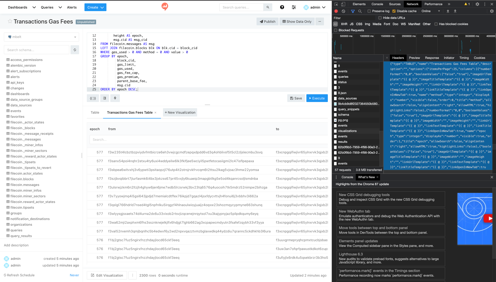
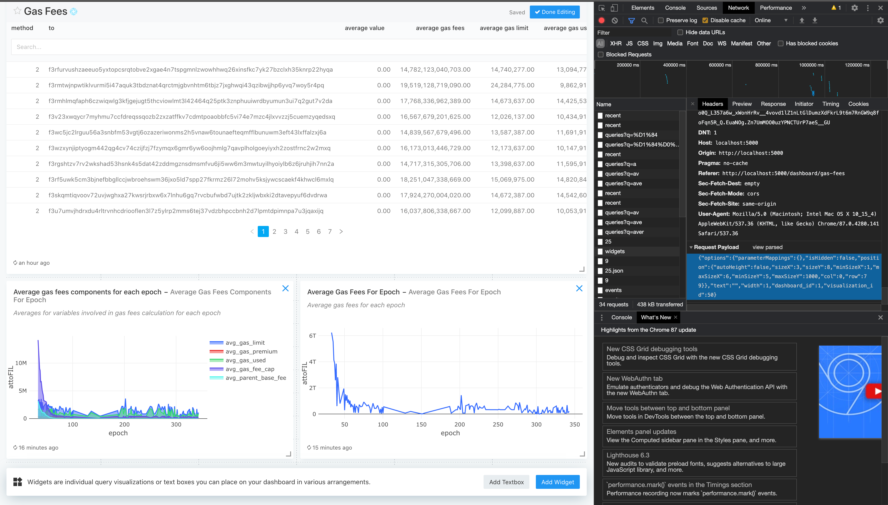

# Redash gas fees dashboard

## Requirements
* Python 3
* Docker v1.11+
* Docker Compose
* Docker has at least 8 GB memory

## Before start
1. Start mbelt-filecoin-streamer to fill database. You can find instructions [here](../README.MD). 
2. Create `.env` file similar to `example.env`.
3. `pip3 install python-dotenv redash-api-client`

#### Environment variables

| Variable | Description | Example |
| ---- | ---- | ---- |
| `REDASH_URL` | URL to redash | http://localhost:5000 |
| `USER_NAME` | Name of user to create in redash | admin |
| `USER_EMAIL` | Email of user to create in redash | admin@p2p.org |
| `USER_PASS` | Redash user's password | supersecret123 |
| `ORG_NAME` | Organization name provided to redash | p2p |
| `DB_HOST` | Database host address | localhost |
| `DB_PORT` | Database port | 5432 |
| `DB_USER` | User in database | sink |
| `DB_PASS` | Password for database user | Ekj31R2_03S2IwLoPsWVa28_sMx_xoS |
| `DB_NAME` | Name of database inside the database :) | raw |
| `DB_SSL_MODE` | Database connection SSL configuration | disable |
| `DB_TYPE` | DBMS name | pg |
| `DATASOURCE_NAME` | Name of datasource in redash | mbelt |
| `DASBOARD_NAME` | Name of dashboard in redash | Gas Fees |
| `QRY_DIR` | Path to directory with queries to export into redash | ./queries |

## Export queries
Run
```shell script
./start-gas-fees-reda.sh
```

It will start redash containers and execute python script, that will export queries in [queries folder](./queries).

Check out the dashboard at http://localhost:5000/dashboard/gas-fees.

## How does it work?

[Python script](./dashboard.py) reads all `.json` and `.sql` files from `QRY_DIR`
environment variable considering all `.json` files are literally JSON that redash frontend
sends to backend to create text widget on the dashboard and all `.sql` files have following structure:
* Every file starts with four comments lines (`-- ...`)
* First comment line is query name (i.e. `-- Gas Fees For Epoch`)
* Second comment line is query description (leave blank if you don't need it)
* Third comment line is literally JSON that redash frontend sends to backend to create query visualization (leave blank if you don't need it)
* Fourth comment line is literally JSON that redash frontend sends to backend to create widget with visualization on dashboard (leave blank if you don't need it)
* Next lines are SQL query to export into redash.

## Query example

```sql
-- Miners Info
-- Miners Info Table
-- {"type":"TABLE","name":"Miners Info","description":"","options":{"itemsPerPage":10,"columns":[{"booleanValues":["false","true"],"imageUrlTemplate":"{{ @ }}","imageTitleTemplate":"{{ @ }}","imageWidth":"","imageHeight":"","linkUrlTemplate":"{{ @ }}","linkTextTemplate":"{{ @ }}","linkTitleTemplate":"{{ @ }}","linkOpenInNewTab":true,"name":"miner","type":"string","displayAs":"string","visible":true,"order":100000,"title":"miner","allowSearch":true,"alignContent":"left","allowHTML":false,"highlightLinks":false},{"booleanValues":["false","true"],"imageUrlTemplate":"{{ @ }}","imageTitleTemplate":"{{ @ }}","imageWidth":"","imageHeight":"","linkUrlTemplate":"{{ @ }}","linkTextTemplate":"{{ @ }}","linkTitleTemplate":"{{ @ }}","linkOpenInNewTab":true,"name":"owner","type":"string","displayAs":"string","visible":true,"order":100001,"title":"owner","allowSearch":true,"alignContent":"left","allowHTML":false,"highlightLinks":false},{"booleanValues":["false","true"],"imageUrlTemplate":"{{ @ }}","imageTitleTemplate":"{{ @ }}","imageWidth":"","imageHeight":"","linkUrlTemplate":"{{ @ }}","linkTextTemplate":"{{ @ }}","linkTitleTemplate":"{{ @ }}","linkOpenInNewTab":true,"name":"worker","type":"string","displayAs":"string","visible":true,"order":100002,"title":"worker","allowSearch":true,"alignContent":"left","allowHTML":false,"highlightLinks":false},{"numberFormat":"0,0","booleanValues":["false","true"],"imageUrlTemplate":"{{ @ }}","imageTitleTemplate":"{{ @ }}","imageWidth":"","imageHeight":"","linkUrlTemplate":"{{ @ }}","linkTextTemplate":"{{ @ }}","linkTitleTemplate":"{{ @ }}","linkOpenInNewTab":true,"name":"miner_raw_byte_power","type":"integer","displayAs":"number","visible":true,"order":100003,"title":"miner_raw_byte_power","allowSearch":false,"alignContent":"right","allowHTML":true,"highlightLinks":false},{"numberFormat":"0,0","booleanValues":["false","true"],"imageUrlTemplate":"{{ @ }}","imageTitleTemplate":"{{ @ }}","imageWidth":"","imageHeight":"","linkUrlTemplate":"{{ @ }}","linkTextTemplate":"{{ @ }}","linkTitleTemplate":"{{ @ }}","linkOpenInNewTab":true,"name":"miner_quality_adj_power","type":"integer","displayAs":"number","visible":true,"order":100004,"title":"miner_quality_adj_power","allowSearch":false,"alignContent":"right","allowHTML":true,"highlightLinks":false},{"numberFormat":"0,0","booleanValues":["false","true"],"imageUrlTemplate":"{{ @ }}","imageTitleTemplate":"{{ @ }}","imageWidth":"","imageHeight":"","linkUrlTemplate":"{{ @ }}","linkTextTemplate":"{{ @ }}","linkTitleTemplate":"{{ @ }}","linkOpenInNewTab":true,"name":"height","type":"integer","displayAs":"number","visible":true,"order":100005,"title":"height","allowSearch":false,"alignContent":"right","allowHTML":true,"highlightLinks":false},{"numberFormat":"0,0.00","booleanValues":["false","true"],"imageUrlTemplate":"{{ @ }}","imageTitleTemplate":"{{ @ }}","imageWidth":"","imageHeight":"","linkUrlTemplate":"{{ @ }}","linkTextTemplate":"{{ @ }}","linkTitleTemplate":"{{ @ }}","linkOpenInNewTab":true,"name":"balance","type":"float","displayAs":"number","visible":true,"order":100006,"title":"balance","allowSearch":false,"alignContent":"right","allowHTML":true,"highlightLinks":false},{"numberFormat":"0,0","booleanValues":["false","true"],"imageUrlTemplate":"{{ @ }}","imageTitleTemplate":"{{ @ }}","imageWidth":"","imageHeight":"","linkUrlTemplate":"{{ @ }}","linkTextTemplate":"{{ @ }}","linkTitleTemplate":"{{ @ }}","linkOpenInNewTab":true,"name":"hours_running","type":"integer","displayAs":"number","visible":true,"order":100007,"title":"hours_running","allowSearch":false,"alignContent":"right","allowHTML":true,"highlightLinks":false}]},"query_id":26}
-- {"options":{"parameterMappings":{},"isHidden":false,"position":{"autoHeight":true,"sizeX":6,"sizeY":12,"maxSizeY":1000,"maxSizeX":6,"minSizeY":1,"minSizeX":2,"col":0,"row":142}},"text":"","width":1,"dashboard_id":1,"visualization_id":42}
SELECT T.miner,
       T.owner,
       T.worker,
       T.miner_raw_byte_power,
       T.miner_quality_adj_power,
       T.height,
       act.balance * 0.000000000000000001 AS balance,
       hours_running
FROM
  (SELECT miner,
          OWNER,
          worker,
          miner_raw_byte_power,
          miner_quality_adj_power,
          height,
          row_number() over(PARTITION BY miner
                            ORDER BY height DESC) AS rn
   FROM filecoin.miner_infos) AS T
LEFT JOIN
  (SELECT addr,
          balance,
          height
   FROM
     (SELECT addr,
             balance,
             height,
             row_number() over(PARTITION BY addr
                               ORDER BY height DESC) AS act_rn
      FROM filecoin.actor_states) AS D
   WHERE act_rn = 1) AS act ON T.miner = act.addr
LEFT JOIN
  (SELECT miner_blocks.miner,
          miner_blocks.blocks,
          miner_blocks.win_counts,
          last_tipset,
          (
             (SELECT max(height) AS latest_epoch
              FROM filecoin.tipsets) - min(inf.height)) / 120 AS hours_running
   FROM
     (SELECT miner,
             count(*) AS blocks,
             sum(win_count) AS win_counts,
             max(height) AS last_tipset
      FROM filecoin.blocks
      GROUP BY miner) AS miner_blocks
   LEFT JOIN filecoin.miner_infos AS inf ON miner_blocks.miner = inf.miner
   GROUP BY miner_blocks.miner,
            miner_blocks.blocks,
            miner_blocks.win_counts,
            last_tipset) AS min_blks ON T.miner = min_blks.miner
WHERE rn = 1;
```

## How to add queries

The easiest way to add text widget is to create it in redash and copy JSON that it produces
using developers tools in a browser. Then put it in `.json` file in queries folder.

To create a query with visualization and it's widget create `.sql` file where:
1. First line is a comment with query name
2. Second line is a comment with query description (leave blank if you don't need it)
3. Third line is a comment with JSON that redash frontend sends to backend to create query visualization (leave blank if you don't need it)
4. Fourth line is a comment with JSON that redash frontend sends to backend to create widget with visualization on dashboard (leave blank if you don't need it)
5. Next lines are SQL query to export into redash.

Use browser developers tools to get jsons mentioned in paragraphs 3 and 4.
Ideally you want to copy JSON used to create visualization or widget, not to edit existing one,
but sometimes (especially with widgets) you have to use edit queries.
To use edit queries you need to remove `"created_at"`, `"updated_at"` and `"id"` fields in case of visualization edit query
and remove just `"id"` field in case of widget edit query.

Copying visualization creation json.


Copying widget creation json.



